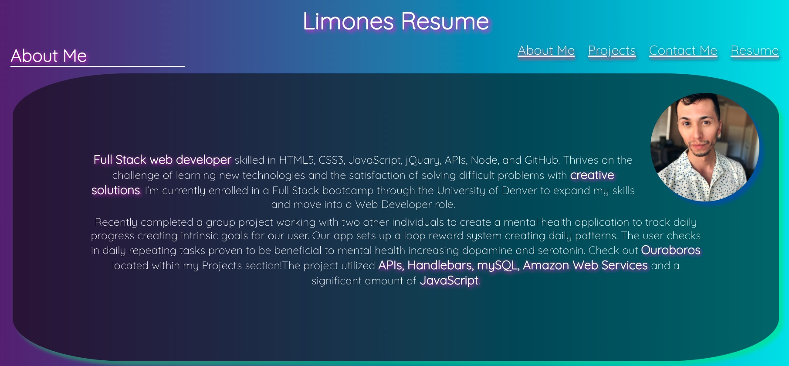

# React Portfolio

## Description

Updated portfolio created with React!! Used my previous portfolio as motivation and built off that. Tried to keep it colorful and fun!

## Table of Contents

- [Visual Example](#visual-example)
- [Deployed Site](#deployed-site)
- [Tech Used](#tech-used)
- [Questions](#questions)
- [License](#license)

## Visual Example

(<a href="#top">back to top</a>)

## Deployed Site

https://zestylimones.github.io/react-portfolio/

(<a href="#top">back to top</a>)

## Tech Used

(<a href="#top">back to top</a>)

## Questions

If you have any questions you can reach me via:

- email: micheal@zestylimones.com
- LinkedIn: https://www.linkedin.com/in/micheal-limones/

(<a href="#top">back to top</a>)

## License

MIT

(<a href="#top">back to top</a>)

